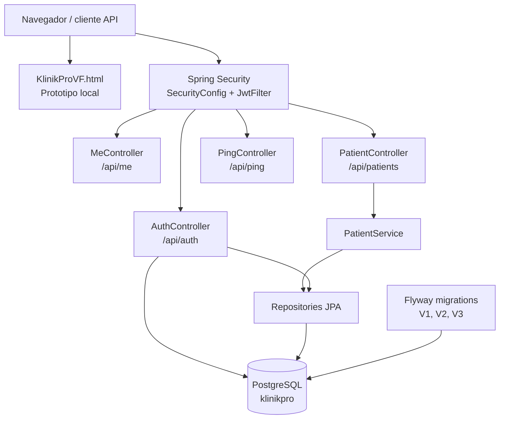
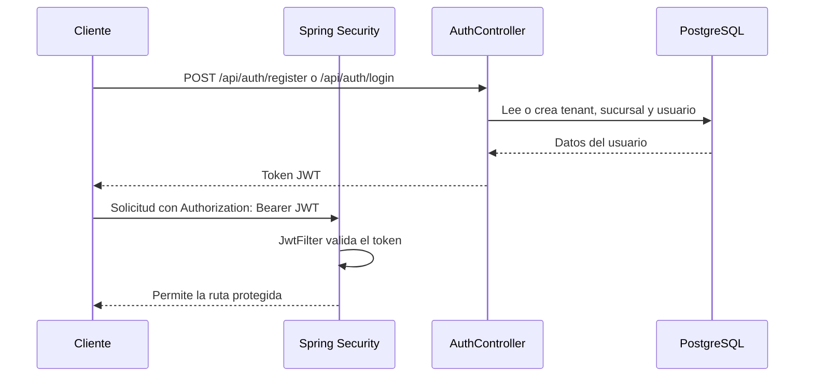

# Arquitectura y rutas de KlinikProVF

Este documento describe la estructura actual del proyecto, las carpetas principales, los archivos relevantes y las rutas HTTP implementadas.

## Vista general

El workspace contiene dos partes:

- `KlinikProVF.html`: prototipo funcional local para navegador.
- `klinikpro-vf/`: backend Spring Boot con PostgreSQL, Flyway, JPA, Spring Security y JWT.

El backend se ejecuta actualmente en `http://localhost:8081`.

## Estructura de carpetas y archivos

```text
KlinikProVF/
|-- ARQUITECTURA.md                 # Este documento
|-- HISTORIAL.md                    # Historial funcional o de cambios
|-- README.md                       # Descripcion general y puesta en marcha
|-- KlinikProVF.html                # Prototipo local HTML/CSS/JavaScript
`-- klinikpro-vf/                   # Aplicacion Spring Boot
    |-- pom.xml                     # Dependencias y configuracion Maven
    |-- mvnw                         # Maven Wrapper para Linux/macOS
    |-- mvnw.cmd                     # Maven Wrapper para Windows
    |-- docker-compose.yml           # Servicio PostgreSQL local
    |-- HELP.md                      # Ayuda generada por Spring Initializr
    `-- src/
        |-- main/
        |   |-- java/systems/cytohelix/klinikpro_vf/
        |   |   |-- KlinikproVfApplication.java  # Punto de entrada Spring Boot
        |   |   |-- PingController.java           # Endpoint de salud
        |   |   |-- auth/                         # Seguridad y usuarios
        |   |   |   |-- AuthController.java       # Registro y login
        |   |   |   |-- JwtFilter.java             # Filtro de token JWT
        |   |   |   |-- JwtService.java             # Emision y validacion JWT
        |   |   |   |-- MeController.java           # Contexto del usuario actual
        |   |   |   |-- Role.java                  # Roles disponibles
        |   |   |   |-- SecurityConfig.java        # Reglas HTTP de seguridad
        |   |   |   |-- TenantContext.java         # Tenant y sucursal actuales
        |   |   |   |-- User.java                  # Entidad de usuario
        |   |   |   `-- UserRepository.java         # Persistencia de usuarios
        |   |   |-- patients/                      # Gestion de pacientes
        |   |   |   |-- Patient.java                # Entidad de paciente
        |   |   |   |-- PatientController.java      # API REST de pacientes
        |   |   |   |-- PatientDtos.java            # DTOs de entrada
        |   |   |   |-- PatientRepository.java      # Persistencia de pacientes
        |   |   |   `-- PatientService.java          # Logica de pacientes
        |   |   `-- shared/
        |   |       `-- ApiExceptionHandler.java    # Manejo comun de errores
        |   `-- resources/
        |       |-- application.yml                 # Puerto y configuracion
        |       |-- db/migration/
        |       |   |-- V1__init_tenancy.sql       # Tenants y sucursales
        |       |   |-- V2__schema_core.sql         # Esquema principal
        |       |   `-- V3__auth.sql                # Tablas de autenticacion
        |       |-- static/                         # Recursos estaticos
        |       `-- templates/                      # Plantillas del servidor
        `-- test/java/                              # Pruebas automatizadas
```

> `target/` contiene artefactos generados por Maven (`classes`, `test-classes`, reportes y metadatos). No es codigo fuente y puede regenerarse con Maven.

## Rutas HTTP del backend

Todas las rutas, excepto las indicadas como publicas, requieren el encabezado:

```http
Authorization: Bearer <jwt>
```

| Metodo | Ruta | Acceso | Funcion |
|---|---|---|---|
| `GET` | `/api/ping` | Publico | Comprueba que la API esta activa y devuelve version y estado. |
| `POST` | `/api/auth/register` | Publico | Crea tenant, sucursal principal y usuario administrador; devuelve JWT. |
| `POST` | `/api/auth/login` | Publico | Valida email y password; devuelve JWT, rol y nombre. |
| `GET` | `/api/me` | JWT | Devuelve `tenantId` y `branchId` del usuario autenticado. |
| `GET` | `/api/patients` | JWT | Lista pacientes; acepta `?q=` para busqueda. |
| `GET` | `/api/patients/{id}` | JWT | Consulta un paciente por UUID. |
| `POST` | `/api/patients` | JWT | Crea un paciente. |
| `PUT` | `/api/patients/{id}` | JWT | Actualiza un paciente. |
| `DELETE` | `/api/patients/{id}` | JWT | Elimina un paciente y devuelve `deleted: true`. |
| `GET` | `/actuator/health` | Publico | Health check de Actuator. |
| `GET` | `/actuator/info` | Publico | Informacion expuesta por Actuator. |

## Reglas de seguridad

Las reglas se definen en `src/main/java/systems/cytohelix/klinikpro_vf/auth/SecurityConfig.java`:

- `/api/ping`, `/actuator/**` y `/api/auth/**` son publicas.
- Cualquier otra ruta requiere autenticacion.
- La sesion es stateless; la autenticacion se transporta mediante JWT.
- CSRF esta deshabilitado para la API.
- El `JwtFilter` se ejecuta antes de `UsernamePasswordAuthenticationFilter`.
- Los roles disponibles son `ADMIN`, `COORDINADOR`, `FISIO` y `RECEPCION`.

## Diagrama de componentes



## Flujo de autenticacion



## Persistencia y configuracion

- Base de datos: PostgreSQL.
- Migraciones: `src/main/resources/db/migration/`.
- JPA usa `ddl-auto: validate`, por lo que el esquema debe existir mediante Flyway.
- Configuracion principal: `src/main/resources/application.yml`.
- Puerto HTTP actual: `8081`.
- La conexion local configurada usa PostgreSQL en `localhost:5433`; verificar `docker-compose.yml` si el mapeo cambia.

## Puesta en marcha

Desde `klinikpro-vf/`:

```bash
docker compose up -d db
./mvnw spring-boot:run
```

En Windows se puede usar:

```powershell
mvnw.cmd spring-boot:run
```

Comprobacion rapida:

```text
http://localhost:8081/api/ping
```
